# KMS Starfarm — Knowledge Management System

## User Guide & Project Overview

| | |
|---|---|
| **Document** | KMS Starfarm User Guide |
| **Version** | 2.0 |
| **Date** | August 28, 2026 |
| **System** | KMS Starfarm v1.0.0 |
| **Purpose** | Project deliverable & end-user guide (CTU request response) |

---

## Table of Contents

1. [Introduction](#1-introduction)
2. [System Architecture](#2-system-architecture)
3. [Use Cases by User Role](#3-use-cases-by-user-role)
4. [Getting Started](#4-getting-started)
5. [KPI Analysis Dashboard](#5-kpi-analysis-dashboard)
6. [Document Management](#6-document-management)
7. [AI Chat Assistant (RAG)](#7-ai-chat-assistant-rag)
8. [Knowledge Pipeline Configuration](#8-knowledge-pipeline-configuration)
9. [KPI Extraction & Review Workflow](#9-kpi-extraction--review-workflow)
10. [Settings & Administration](#10-settings--administration)
11. [End-to-End Scenario Walkthroughs](#11-end-to-end-scenario-walkthroughs)
12. [Appendix](#12-appendix)

---

## 1. Introduction

### 1.1 What is KMS Starfarm?

KMS Starfarm is a full-stack **Knowledge Management System (KMS)** with integrated **Retrieval-Augmented Generation (RAG)** capabilities. It was designed to help agricultural programme teams store, search, analyse, and extract insights from their project documentation in one centralised platform.

**Key capabilities:**

- **Document repository** — Upload, parse, organise, and preview project documents (PDF, Word, text, etc.).
- **AI-powered search & chat** — Ask natural-language questions and receive answers grounded in your own documents, with source citations.
- **KPI extraction & dashboard** — Automatically extract performance indicators from uploaded reports and visualise them across agricultural value chains.
- **Multi-tenant & role-based** — Support for organisations, teams, roles, and API keys.

### 1.2 Purpose of This Document

This guide serves a dual purpose, in response to the CTU deliverables request:

1. **Showcasing project progress** — Demonstrating the current state of the KMS, its features, and the extent of implementation to date (including KPIs, indicators, and document management).
2. **Teaching end users how to operate the system** — Step-by-step instructions for every major feature, illustrated with screenshots from the live application.

### 1.3 Intended Audience

- **Programme managers and reviewers** who need to understand what the KMS delivers and how it works.
- **End users** (project staff, analysts, field coordinators) who will use the system day-to-day.
- **System administrators** who will configure and maintain the platform.

---

## 2. System Architecture

### 2.1 High-Level Platform Overview

The platform is a monolithic web application comprising a React frontend, a FastAPI backend, an LLM inference server, a vector search engine, and a task queue — all running locally without Docker.

```
┌─────────────────────────────────────────────────────────────────────┐
│                        KMS STARFARM PLATFORM                       │
├─────────────────────────────────────────────────────────────────────┤
│                                                                     │
│   ┌─────────────┐                                                   │
│   │  React SPA  │  Dashboard · Chat · Documents · KPI Review        │
│   │  (port 5173)│  Settings · Knowledge Config · Auth               │
│   └──────┬──────┘                                                   │
│          │  HTTP / REST API calls                                   │
│          ▼                                                          │
│   ┌──────────────────────────────────────────────────┐              │
│   │           FastAPI Backend  (port 8081)            │              │
│   │                                                   │              │
│   │   /chat  ·  /ingestion  ·  /config  ·  /dashboard│              │
│   │   /auth  ·  /embed  ·  /database  ·  /api-keys   │              │
│   └────┬──────────────┬──────────────┬───────────────┘              │
│        │              │              │                               │
│   ┌────┴────┐  ┌──────┴──────┐  ┌───┴──────────┐                  │
│   │  LLM    │  │  FAISS      │  │  Celery +    │                   │
│   │  Server │  │  Vector     │  │  Redis       │                   │
│   │  (8000) │  │  Store      │  │  (6379)      │                   │
│   │         │  │  (local)    │  │  async tasks │                   │
│   └─────────┘  └─────────────┘  └──────────────┘                  │
│                                                                     │
│   ┌──────────────────────────────────────────────────────────┐     │
│   │  Data Stores                                              │     │
│   │  ┌────────────┐ ┌──────────┐ ┌──────────┐ ┌───────────┐ │     │
│   │  │  SQLite /  │ │  FAISS   │ │  Local   │ │  JSON     │ │     │
│   │  │  LiteDB    │ │  index   │ │  uploads │ │  (KPI     │ │     │
│   │  │  (meta)    │ │  (vectors│ │  (files) │ │  cache)   │ │     │
│   │  └────────────┘ └──────────┘ └──────────┘ └───────────┘ │     │
│   └──────────────────────────────────────────────────────────┘     │
└─────────────────────────────────────────────────────────────────────┘
```

### 2.2 Technology Stack

| Layer | Technology | Role |
|-------|-----------|------|
| **Frontend** | React 18 + TypeScript + Vite 6 | SPA user interface |
| **UI Components** | shadcn/ui (Radix UI) + Tailwind CSS 3.4 | Component library + styling |
| **Routing** | React Router DOM v7 | Client-side routing |
| **Charts** | Chart.js + react-chartjs-2 | KPI dashboard visualisations |
| **PDFs** | react-pdf + pdfjs-dist | In-app document preview |
| **Backend** | FastAPI (Python 3.11–3.12) | REST API + business logic |
| **Task Queue** | Celery 5.4 + Redis 7 | Async parsing, summarisation, embedding |
| **LLM** | vLLM-MLX / Ollama (Llama 3.2 3B) | Chat generation, KPI extraction |
| **RAG Framework** | LangGraph + LangChain | Chatbot orchestration graph |
| **Embeddings** | HuggingFace `all-MiniLM-L6-v2` | 384-dimensional vector representations |
| **Vector Store** | FAISS | Approximate nearest-neighbor search |
| **Database** | LiteDB / SQLite (local) / PostgreSQL (prod) | Document metadata, users, roles |
| **Storage** | Local filesystem / MinIO | Uploaded file storage |
| **Auth** | Supabase Auth (mock mode for local) | JWT-based authentication |

### 2.3 Component Responsibilities

| Component | Path | Responsibility |
|-----------|------|---------------|
| Chat Routes | `simba/api/chat_routes.py` | `POST /chat/` — streams RAG answers via LangGraph |
| Dashboard Routes | `simba/api/dashboard_routes.py` | `GET/POST /dashboard/kpi*` — KPI CRUD, extraction, review |
| Ingestion Routes | `simba/api/ingestion_routes.py` | `POST /ingestion/` — file upload, document CRUD |
| Embed Routes | `simba/api/embed_routes.py` | `POST /embed/documents` — vectorise enabled documents |
| Config Routes | `simba/api/config_routes.py` | `GET/PUT /config` — pipeline settings |
| Auth Routes | `simba/api/auth_routes.py` | `POST /auth/signin, signup, signout` |
| Retriever | `simba/retrieval/` | 6 strategies: default, semantic, keyword, hybrid, ensemble, reranked |
| Splitter | `simba/splitting/splitter.py` | 5 strategies: recursive, semantic, markdown_header, hierarchical, context_aware |
| Vector Store | `simba/vector_store/` | FAISS operations: add, search, delete, rerank, context compression |
| LangGraph Chatbot | `simba/chatbot/demo/graph.py` | 8-node state graph with checkpointer |
| Database | `simba/database/` | LiteDB/PostgreSQL document metadata storage |
| Embeddings | `simba/embeddings/embedding_service.py` | HuggingFace sentence-transformers embeddings |

### 2.4 LangGraph RAG Pipeline — Chat Flow

Every question submitted via the Chat page passes through an 8-node **LangGraph state machine** before returning an answer. This is not a simple prompt → response — the system retrieves, reranks, generates, and self-checks before answering.

```
                              User Question
                                  │
                                  ▼
                          ┌────────────────┐
                          │   ROUTING      │  Decides: "fallback" or "transform_query"
                          │   NODE         │  (Currently forced to transform_query)
                          └───┬────────┬───┘
                              │        │
                      (fallback)  (transform_query)
                              │        │
                              ▼        ▼
                         ┌────┐  ┌────────────────────┐
                         │END │  │  TRANSFORM QUERY   │  LLM rephrases the question
                         └────┘  │  (rewrite)         │  using chat history for context
                                 └────────┬───────────┘
                                          │
                                          ▼
                                 ┌────────────────────┐
                                 │  CoT (Chain-of-    │  Checks document summaries
                                 │  Thought)          │  from DB; decides if summaries
                                 │                    │  alone are enough or retrieval needed
                                 └────────┬───────────┘
                                          │
                                          ▼
                                 ┌────────────────────┐
                                 │  RETRIEVE          │  FAISS cosine similarity search
                                 │                    │  Returns top-K relevant chunks
                                 └────────┬───────────┘
                                          │
                                          ▼
                                 ┌────────────────────┐
                                 │  RERANK            │  Cross-encoder re-scores all
                                 │                    │  retrieved chunks, keeps top-20
                                 └────────┬───────────┘
                                          │
                                          ▼
                                 ┌────────────────────┐
                                 │  GENERATE          │  LLM generates streaming answer
                                 │  (RAG chain)       │  using chunks + chat history
                                 └────────┬───────────┘
                                          │
                                          ▼
                                 ┌────────────────────┐
                                 │  HALLUCINATION     │  Two-step grading:
                                 │  CHECK             │  1) Is answer grounded in docs?
                                 │                    │  2) Does answer address the Q?
                                 └───┬────────────┬───┘
                                     │            │
                              (not supported)   (useful → END → returned to user)
                                     │
                                     ▼
                                ┌────────┐
                                │  END   │  Fallback message returned
                                └────────┘
```

**Node detail:**

| Node | What it does | LLM calls |
|------|-------------|-----------|
| **Routing** | Classifies the question type; currently forces all questions to `transform_query` | None (hardcoded) |
| **Transform Query** | Rewrites the question using chat history, decomposes into sub-queries | 1 (rewrite chain) |
| **CoT (Chain-of-Thought)** | Reads all document summaries from DB; decides if summaries alone answer the question | 1 (CoT chain) |
| **Retrieve** | FAISS similarity search using the transformed query; returns top-K chunks | None (vector search) |
| **Rerank** | Cross-encoder model rescores retrieved documents by relevance; keeps top-20 | None (cross-encoder) |
| **Generate** | LLM generates answer from retrieved chunks + summaries + chat history | 1 (generate chain) |
| **Hallucination Check** | Two-step: grades if answer is grounded in docs, then grades if answer addresses question | 2 (hallucination + correctness chains) |
| **Fallback** | Returns: *"I'm sorry, I don't know how to answer that..."* | None |

**State persisted across turns** via a file-based checkpointer (`simba_memory.pkl`), enabling multi-turn conversations with memory.

### 2.5 Document Lifecycle

Every document goes through a defined pipeline from upload to queryability:

```
  UPLOAD           PARSE            CHUNK            EMBED           INDEX
┌──────────┐   ┌──────────┐   ┌──────────┐   ┌──────────┐   ┌──────────┐
│  File    │   │  Text    │   │  Split   │   │  Vector  │   │  FAISS   │
│  saved   │──▶│  extraced│──▶│  into    │──▶│  embed   │──▶│  added   │
│  locally │   │  from    │   │  overlap-│   │  384-dim │   │  to      │
│          │   │  PDF/    │   │  ping    │   │  vectors │   │  index   │
│  LiteDB: │   │  DOCX    │   │  chunks  │   │          │   │          │
│  status= │   │  LiteDB: │   │  LiteDB: │   │  LiteDB: │   │  Search  │
│  unparsed│   │  status= │   │  chunks  │   │  status= │   │  ready   │
│          │   │  parsed  │   │  stored  │   │  enabled │   │          │
└──────────┘   └──────────┘   └──────────┘   └──────────┘   └──────────┘
                                      │                         │
                               Only if ENABLED             When ENABLED
                               (user toggle)              (user toggle)
```

**Key rules:**
- **Upload** saves file to `uploads/`, creates metadata in LiteDB with `parsing_status = "Unparsed"`.
- **Parse** extracts text (via `docling`, `mistral_ocr`, or `text_loader`), splits into chunks (default 1500 chars / 400 overlap), sets `parsing_status = "SUCCESS"`.
- **Enable** toggle ON: chunks are embedded and added to FAISS → the document becomes searchable via Chat and usable for KPI extraction.
- **Disable** toggle OFF: chunks removed from FAISS → document no longer searchable. Metadata preserved.
- **Delete** removes file from disk, metadata from LiteDB, and vectors from FAISS (if enabled).

### 2.6 Data Store Topology

| Store | Technology | What it stores | Location |
|-------|-----------|---------------|----------|
| Metadata DB | LiteDB (SQLite) | Document metadata, chunk info, user/role data, org data | `simba/documents.litedb` |
| Vector Index | FAISS | 384-dim embeddings + document chunk text | `vector_stores/faiss_index/` |
| File Storage | Local filesystem | Original uploaded files (PDF, DOCX, etc.) | `uploads/` |
| KPI Cache | JSON file | LLM-extracted KPI values (approved) | `dashboard_kpis.json` |
| KPI Pending | JSON file | Unapproved KPI extraction results | `dashboard_kpi_pending.json` |
| KPI Baseline | JSON file | Original Excel baseline values | `frontend/public/kpi_data.json` |
| Chat Memory | Pickle file | LangGraph conversation checkpoint | `simba_memory.pkl` |
| Config | YAML | Pipeline settings (LLM, embedding, chunking, retrieval) | `config.yaml` |
| Env Vars | dotenv | Secrets, API keys, env overrides | `.env` |

### 2.7 Retrieval Strategies

| Strategy | How it works | When to use |
|----------|-------------|-------------|
| **Default** | FAISS cosine similarity search, returns top-K results | General-purpose, fast |
| **Semantic** | Pure embedding similarity with configurable score threshold | When you want to filter low-relevance results |
| **Keyword** | BM25 lexical matching on raw text | Exact term matching, technical jargon |
| **Hybrid** | Combines semantic + keyword with configurable priority weighting | Best of both worlds |
| **Ensemble** | Weighted blend of multiple retrievers' scores | Maximum coverage, highest quality |
| **Reranked** | Semantic search + cross-encoder reranking (top-20) | When precision matters most |

### 2.8 Retrieval Strategies — Comparison

```
         Precision        Recall         Speed
         ────────         ──────         ─────
Default    ████░░░░░       ███░░░░░░      ██████████  (fastest)
Semantic   █████░░░░       ███░░░░░░      ████████░░
Keyword    ██░░░░░░░       █████░░░░      █████████░
Hybrid     █████░░░░       █████░░░░      ███████░░░
Ensemble   ██████░░░       ██████░░░      █████░░░░░
Reranked   ███████░░       ████░░░░░      ███░░░░░░░  (slowest, best quality)
```

### 2.9 Deployment Modes

| Mode | Command | Services | Best for |
|------|---------|----------|----------|
| **Local (no Docker)** | `bash start.sh` | Redis + vLLM-MLX + FastAPI + Celery + Vite | Development, demos, local analysis |
| **Docker** | `make build && make up` | All in containers (Ollama optional) | Production, servers, shared access |
| **API-only** | `poetry run simba server --port 8081` | Backend only | SDK integration, headless use |

### 2.10 API Endpoints Summary

| Endpoint | Method | Purpose | Auth |
|----------|--------|---------|------|
| `/auth/signup` | POST | Register new user | No |
| `/auth/signin` | POST | Log in, receive JWT | No |
| `/auth/signout` | POST | Log out, invalidate session | Yes |
| `/auth/me` | GET | Current user info | Yes |
| `/chat/` | POST | Stream RAG answer (SSE) | Yes |
| `/ingestion/` | POST | Upload document | Yes |
| `/ingestion/documents` | GET | List documents | Yes |
| `/ingestion/documents/{id}` | DELETE | Delete document | Yes |
| `/embed/documents` | POST | Embed all enabled documents | Yes |
| `/embed/document` | POST | Embed single document | Yes |
| `/dashboard/kpi` | GET | Get KPI data (baseline + LLM) | Yes |
| `/dashboard/kpi/recalculate` | POST | Re-run LLM extraction on all enabled docs | Yes |
| `/dashboard/kpi/extract` | POST | Extract KPIs for human review | Yes |
| `/dashboard/kpi/apply` | POST | Apply approved KPI changes | Yes |
| `/config` | GET | Read pipeline config | Yes |
| `/config` | PUT | Update pipeline config | Yes |
| `/database/info` | GET | Database statistics | Yes |
| `/roles` | CRUD | Role-based access control | Yes |
| `/organizations` | CRUD | Multi-tenant org management | Yes |
| `/api/api-keys` | CRUD | API key management | Yes |

The complete API surface is browsable interactively in the Swagger documentation served by the backend at `http://localhost:8081/docs`. Each endpoint can be tested directly from the browser — useful for troubleshooting and for casual integration work.

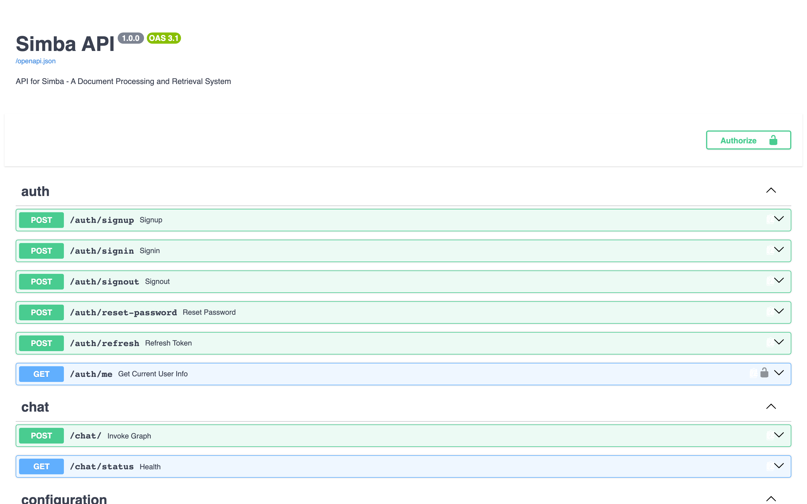

---

## 3. Use Cases by User Role

### 3.1 Programme Manager

| # | Use case | Steps | System effect |
|---|----------|-------|---------------|
| 1 | **Upload baseline survey report** | Documents → Upload → select PDF → Parse → Enable | Document parsed, chunks indexed in FAISS, dashboard staleness flag set |
| 2 | **Ask "What is the cooperative profit gap in Mango?"** | Chat → type question → send | LangGraph retrieves relevant chunks → LLM answers with citation to source document |
| 3 | **Review & approve LLM-extracted KPIs** | Dashboard → Review & Extract → toggle ON/OFF rows → Apply Selected | `dashboard_kpis.json` updated, dashboard cards refresh with new values |
| 4 | **Compare chains in cross-chain view** | Dashboard → Cross-Chain tab → scan table | Identifies which chain or group outperforms others for a given indicator |
| 5 | **Generate AI summary for team sharing** | Documents → click sparkles icon on a row | Celery task generates summary via LLM, stored in document metadata |

*The views this role uses most are the Dashboard (below), the Chat assistant, and the KPI Review page — all covered step-by-step in Chapters 5, 7, and 9.*

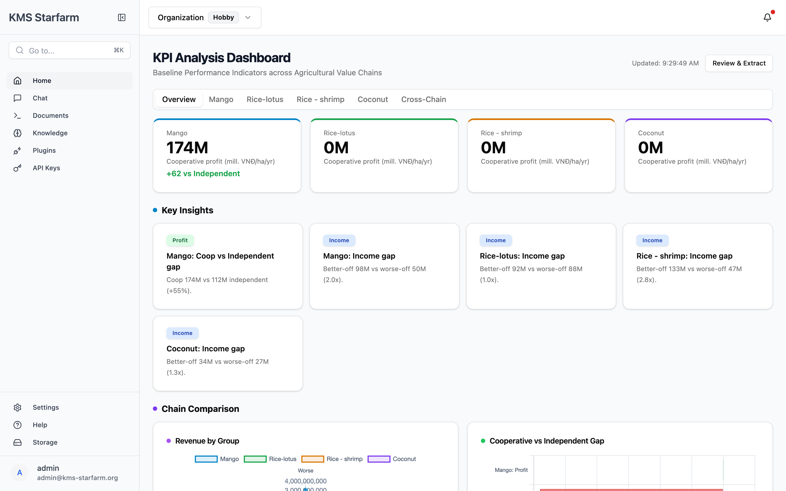

### 3.2 Data Analyst

| # | Use case | Steps | System effect |
|---|----------|-------|---------------|
| 1 | **Bulk upload and selective enable** | Documents → Upload (Folder tab) → select folder → Parse Selected → selectively Enable | All files parsed, only enabled ones embedded in FAISS |
| 2 | **Cross-document analytical queries** | Chat → ask complex question spanning multiple reports | Hybrid retrieval searches across all enabled docs, reranks, generates comparative answer |
| 3 | **Audit KPI extraction accuracy** | KPI Review → filter by chain → inspect proposed vs baseline values | Can toggle off incorrect LLM extractions before applying |
| 4 | **Export answers with citations** | Chat → click Sources(N) → review excerpt → Copy answer | Sources panel shows page number + chunk excerpt for each citation |

*The Folder Upload tab (below) supports the analyst's bulk-ingestion workflows; the Source Panel provides the citations needed for analytical write-ups.*

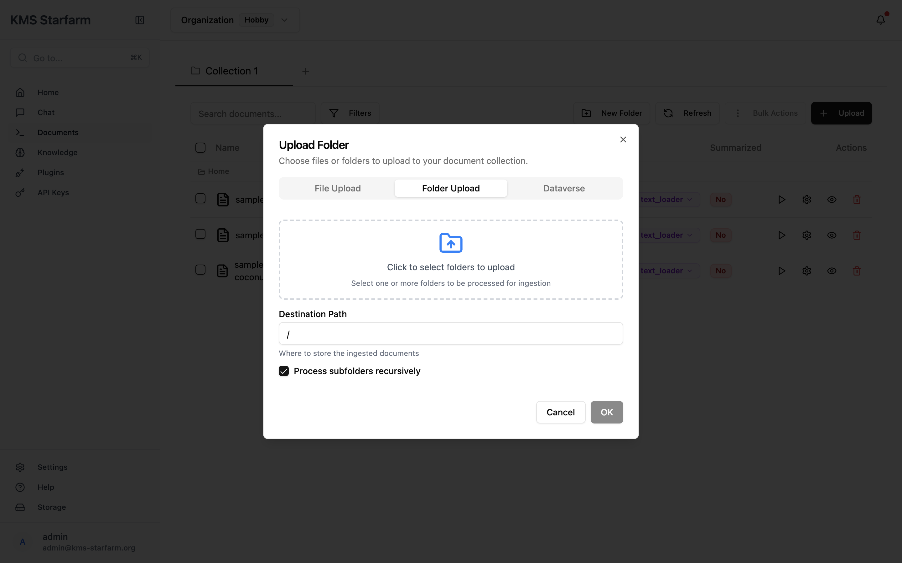

### 3.3 System Administrator

| # | Use case | Steps | System effect |
|---|----------|-------|---------------|
| 1 | **Change LLM provider/model** | Knowledge → verify current config; edit `config.yaml` → restart | LLM calls route to new provider |
| 2 | **Manage users and API keys** | Settings → Members / API Keys | Users granted/revoked access; API keys created for SDK integration |
| 3 | **Clear and rebuild vector index** | `DELETE /database/clear_database` → re-enable all documents | FAISS index cleared, chunks re-embedded from scratch |
| 4 | **Verify production readiness** | Knowledge → review all config sections | Confirms correct LLM, embedding, chunking, retrieval, storage settings |

*The Settings area (below) is the administrator's main console for users, roles, and API keys.*


---

## 4. Getting Started

### 4.1 Prerequisites

- Python 3.11 or 3.12 (Poetry package manager)
- Node.js 20+
- Redis 7.0+
- Git

### 4.2 Installation & Startup

```bash
# 1. Clone the repository
git clone <repository-url>
cd simba

# 2. Install backend dependencies (Poetry)
poetry install

# 3. Install frontend dependencies
cd frontend && npm install && cd ..

# 4. Start all services
bash start.sh
```

After startup the following endpoints are available:

| Service | URL |
|---------|-----|
| Frontend | `http://localhost:5173` |
| Backend API | `http://localhost:8081` |
| LLM (vLLM-MLX) | `http://localhost:8000` |
| Redis | `localhost:6379` |

### 4.3 Logging In

Navigate to `http://localhost:5173`. If not authenticated, you are redirected to the Sign In page.


1. Enter your **Email** and **Password**.
2. Click **Sign in**.
3. On first use (mock/local mode), any email and password will work — the system provisions a default admin account.
4. To create a new account, click **Sign up** and follow the registration flow.
5. If you forgot your password, click **Forgot password?** to receive reset instructions.

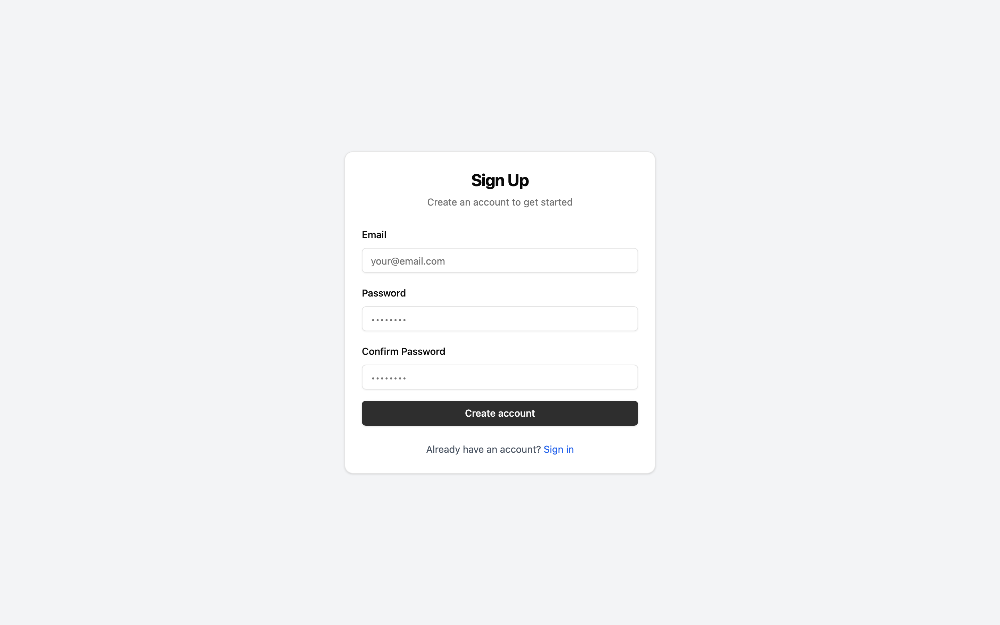

After successful login, the sidebar shows your user identity at the bottom (e.g., `admin / admin@kms-starfarm.org`).

---

## 5. KPI Analysis Dashboard

The KPI Analysis Dashboard is the central view for monitoring performance indicators across the agricultural value chains covered by the project.

### 5.1 Overview

Navigate to **Home** in the sidebar (or directly to `/`). The dashboard loads at the **Overview** tab by default.


**What you see:**

| Element | Description |
|---------|-------------|
| **Hero cards** (4) | One per value chain — shows **Cooperative profit** in million VNĐ/ha/year and the delta vs Independent (e.g., *Mango: 174M, +62 vs Independent*). The card's coloured top border matches the chain. |
| **Key Insights** (5 cards) | Auto-computed highlights, e.g., "Mango: Coop vs Independent gap — Coop 174M vs 112M (+55%)" and Income gaps across chains (Better-off vs Worse-off). |
| **Chain Comparison charts** | *Revenue by Group* (radar/polar chart) and *Cooperative vs Independent Gap* (horizontal bar). |
| **Tab bar** | Overview | Mango | Rice-lotus | Rice-shrimp | Coconut | Cross-Chain — click any to drill into details. |
| **Review & Extract** button | Top-right — launches the KPI extraction & review flow (see Chapter 9). |
| **Updated timestamp** | Top-right — shows when KPI data was last refreshed. |

### 5.2 Dashboard Data Flow

```
                        ┌──────────────────┐
                        │  kpi_data.json   │  ← Baseline (Excel import)
                        │  (always loaded) │
                        └────────┬─────────┘
                                 │
                                 ▼
                        ┌──────────────────┐
                        │  dashboard_      │  ← LLM-extracted values
                        │  kpis.json       │    (approved from review)
                        └────────┬─────────┘
                                 │
                    ┌────────────┴────────────┐
                    │  Merge: baseline as      │
                    │  foundation, LLM values  │
                    │  overwrite where present │
                    └────────────┬────────────┘
                                 │
                                 ▼
                        ┌──────────────────┐
                        │  Dashboard API   │  GET /dashboard/kpi
                        │  response:       │
                        │  chains → KPIs   │
                        │  per group       │
                        └────────┬─────────┘
                                 │
                                 ▼
                        ┌──────────────────┐
                        │  React Dashboard │
                        │  renders hero    │
                        │  cards, charts,  │
                        │  indicator cards │
                        └──────────────────┘
```

### 5.3 What Happens When Documents Change

| Action | Dashboard effect |
|--------|-----------------|
| Document **enabled** | `is_stale = true` set; amber "New data available" banner appears; auto-recalculate triggered |
| Document **disabled** | Same staleness detection; previous LLM-extracted values cleared if docs changed |
| Document **deleted** | Staleness detected; next dashboard load triggers recalculation |
| **No enabled docs** | Dashboard shows only baseline values from `kpi_data.json` (no LLM enrichment) |
| **Recalculate** button clicked | Full LLM extraction re-run on all enabled docs; `dashboard_kpis.json` overwritten |

### 5.4 Chain Detail Tab

Click any chain tab (e.g., **Mango**) to see indicator-level detail.

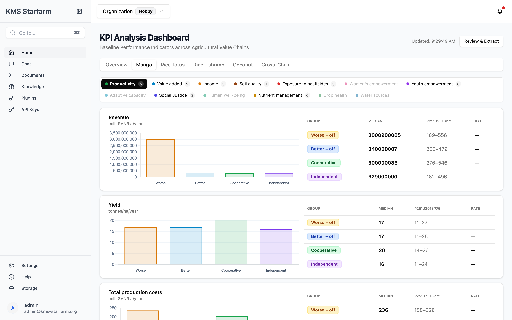

**Filter bar (top):** 13 KPI category pills, each with a count badge:

`Productivity (5) · Value added (2) · Income (3) · Soil quality (1) · Exposure to pesticides (3) · Women's empowerment · Youth empowerment (6) · Adaptive capacity · Social Justice (3) · Human well-being · Nutrient management (6) · Crop health · Water sources`

Click a pill to filter. Active category is highlighted in dark.

**Indicator cards:** Each indicator (e.g., *Revenue*, *Yield*, *Total production costs*) is rendered as a card with:

- A **bar chart** comparing median values across the four groups: **Worse-off**, **Better-off**, **Cooperative**, **Independent**.
- A **detail table** on the right with columns: Group, Median, P25–P75 range, Rate.

For example, *Yield* in Mango shows Cooperative farms achieving 20 tonnes/ha/year — higher than all other groups.

### 5.5 Cross-Chain Comparison

Click the **Cross-Chain** tab to compare the same indicator across all value chains side by side.

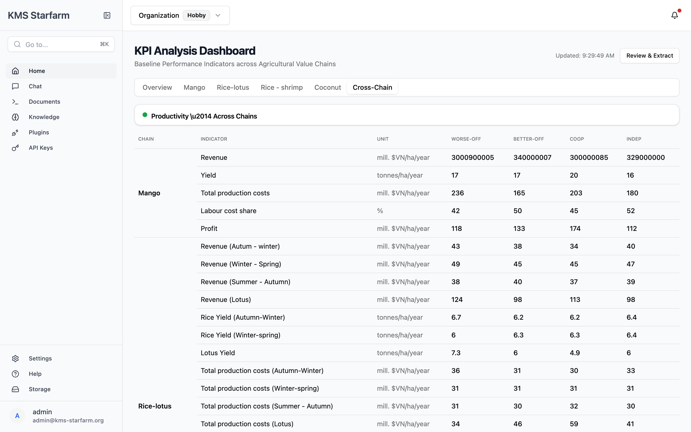

This tab renders a table per KPI category. Each row shows one indicator with its median values in all four chains, broken down by group (Worse-off, Better-off, Cooperative, Independent). Use it to quickly spot which chain or group outperforms others for a given indicator.

*For example, the Productivity section shows Mango Revenue and Yield alongside Rice-lotus and other chain values in the same view.*

---

## 6. Document Management

The Documents page is the knowledge base for all project files. It handles upload, parsing, embedding, and preview.

Navigate via **Documents** in the sidebar.

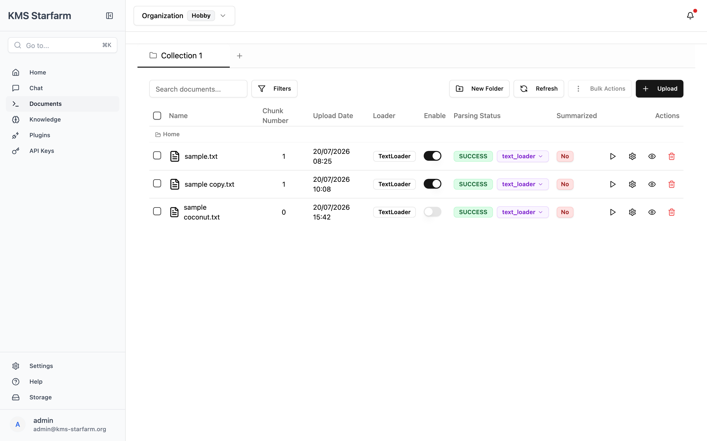

### 6.1 Layout

| Element | Description |
|---------|-------------|
| **Collection tabs** | Top bar — organises documents into collections (e.g., *Collection 1*). Click **+** to add a new collection. |
| **Search bar** | Filter documents by name. |
| **Filters** button | Show/hide columns and filter by Parsing Status or Summarised flag. |
| **New Folder** | Create a folder inside the current collection. |
| **Refresh** | Reload the document list from the server. |
| **Bulk Actions** | Appears when one or more rows are selected — e.g., *Parse Selected*, *Summarise Selected*. |
| **Upload** (black button) | Open the file upload dialog. |

### 6.2 Document Table Columns

| Column | Description |
|--------|-------------|
| **Checkbox** | Select documents (Shift+click for range). |
| **Name** | File name with type icon. Hover to inline-rename. |
| **Chunk Number** | Number of text chunks produced after parsing. |
| **Upload Date** | When the file was uploaded. |
| **Loader** | Parser/engine used (e.g., `TextLoader`). |
| **Enable** (toggle) | Switch ON to embed the document and make it queryable via Chat and KPI extraction. OFF documents are stored but not indexed. |
| **Parsing Status** | `SUCCESS` (green), `FAILED` (red), `PENDING` (orange), or `Unparsed` (grey). A parser dropdown (e.g., `text_loader`) lets you switch parser before re-parsing. |
| **Summarised** | Whether an AI summary has been generated (`Yes`/`No`). Hover the sparkles icon to generate. |
| **Actions** | Per-row: **Parse** (▶), **Configure parser** (⚙), **Preview** (👁), **Delete** (🗑). |

### 6.3 Uploading Documents

1. Click **Upload** → a dialog with three tabs opens:
   - **File Upload** — Drag & drop or click to select files (`.pdf`, `.doc`, `.docx`, `.txt`, `.md`). Shows *Uploading to: {folder}* when inside a folder.
   - **Folder Upload** — Import an entire local folder (with *Process subfolders recursively* option).
   - **Dataverse** — Import by dataset persistent ID (e.g., `doi:10.7910/...`).

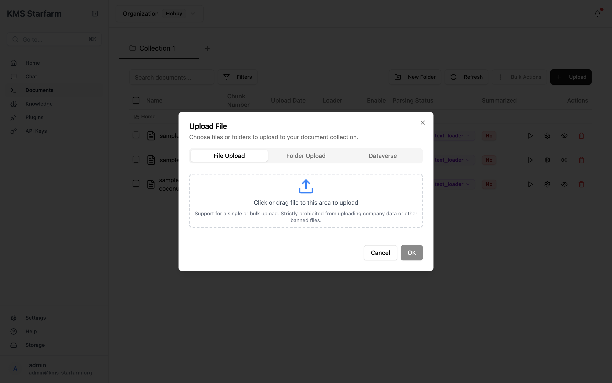


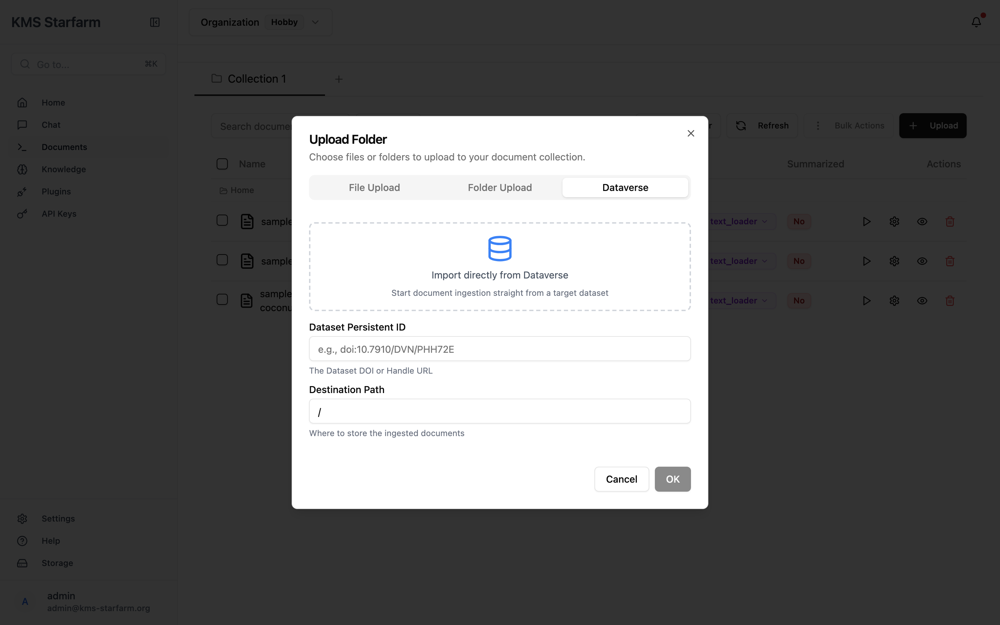

2. While uploading, a **progress bar overlay** appears: *Preparing files → Uploading → Processing*.
3. After upload, documents appear in the table with Parsing Status `Unparsed` — click **Parse** (▶) or **Bulk Actions → Parse Selected** to parse them.

### 6.4 Enabling Documents for Search

Toggling **Enable** ON embeds the document's chunks into FAISS. Only enabled documents are:

- Searched when you ask questions in Chat.
- Used as source material for KPI extraction.

> **Tip:** Enable only the documents that contain reliable data. The system currently shows *sample.txt*, *sample copy.txt*, and *sample coconut.txt* as examples — enable the two with the toggle in the ON position.

### 6.5 Previewing a Document

Click the **eye (👁) icon** on any row to open **PreviewModal**:

- **Left panel — Original Document** — Rendered file (PDF/image/text) with *Download* and *Open in Tab* buttons.
- **Right panel — Document Chunks** — The parsed text chunks (e.g., *Chunk 1*) rendered as Markdown. Each chunk has action icons: **AI summary**, **Edit**, **Delete**.

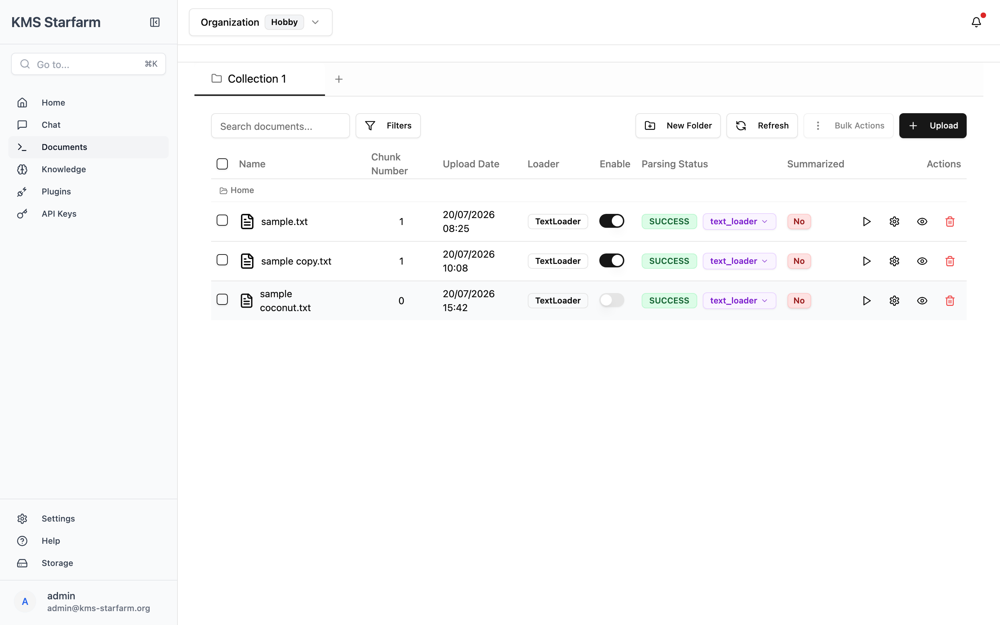

### 6.6 File Organisation

- **New Folder** button opens the folder-creation dialog (below); the new folder appears in the breadcrumb path.
- **Drag & drop** a row onto a folder to move the document.
- **Breadcrumb** (Home / folder) shows the current location.
- **Floating bulk bar** appears when items are selected, with *Parse Selected*, *Enable/Disable*, and *Delete* actions.

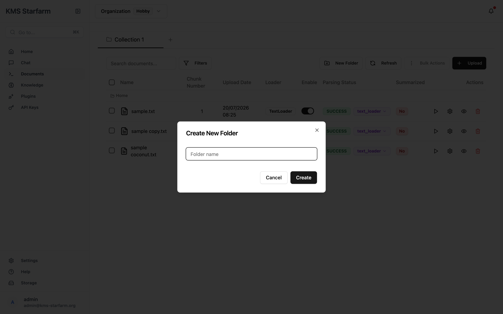

---

## 7. AI Chat Assistant (RAG)

The Chat page provides a conversational AI that answers questions **grounded in your uploaded documents** — it does not hallucinate from general knowledge.

Navigate via **Chat** in the sidebar.

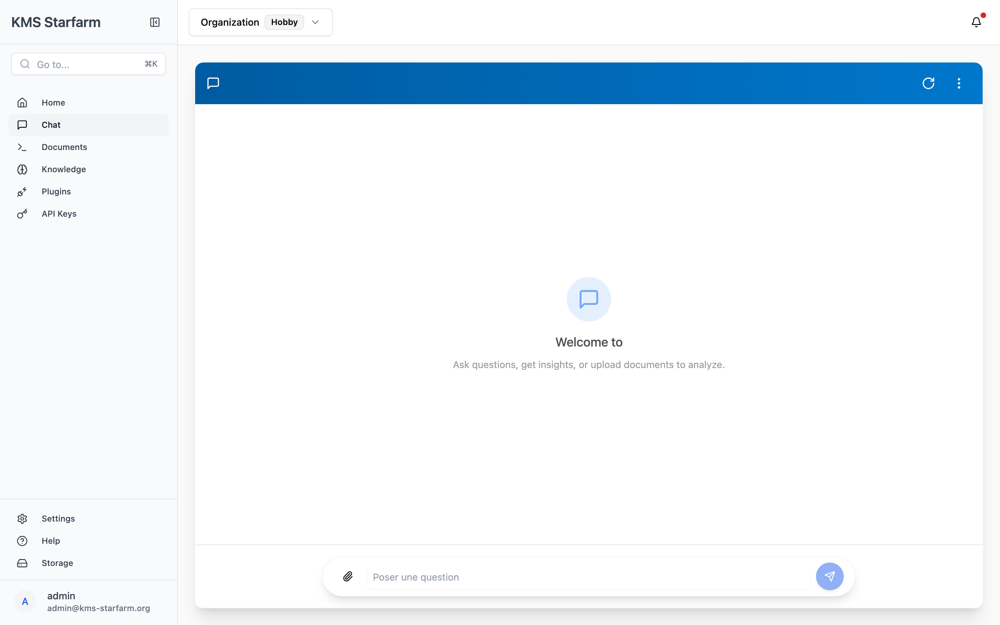

### 7.1 Interface Overview

| Element | Description |
|---------|-------------|
| **Blue header bar** | Chat title with a **refresh** (↻) button and a **⋯ menu** (*Nouvelle discussion* / *Terminer la discussion*). |
| **Empty state** | Centred card — *"Welcome to … Ask questions, get insights, or upload documents to analyze."* |
| **Input bar** (bottom) | Paperclip (📎) to upload files inline, text field placeholder *"Poser une question"* (Ask a question), and a blue circular **send** button (✈). |

### 7.2 What Happens When You Ask a Question

Here is the exact sequence of events inside the system:

```
  User types: "What is the revenue for cooperative mango farmers?"
                            │
                            ▼
  ┌─────────────────────────────────────────────────────────┐
  │ 1. TRANSFORM QUERY                                      │
  │    LLM rewrites question using chat history             │
  │    → Sub-queries generated for better retrieval         │
  └────────────────────────┬────────────────────────────────┘
                           │
                           ▼
  ┌─────────────────────────────────────────────────────────┐
  │ 2. COT (CHAIN-OF-THOUGHT)                               │
  │    Reads summaries of all documents in database         │
  │    Decides: summaries enough? → Yes: answer from summary│
  │                                  No: → full retrieval  │
  └────────────────────────┬────────────────────────────────┘
                           │
                           ▼
  ┌─────────────────────────────────────────────────────────┐
  │ 3. RETRIEVE (FAISS)                                     │
  │    Cosine similarity search on 384-dim embeddings       │
  │    Returns top-K most similar chunks                    │
  │    Only searches ENABLED documents                      │
  └────────────────────────┬────────────────────────────────┘
                           │
                           ▼
  ┌─────────────────────────────────────────────────────────┐
  │ 4. RERANK (Cross-encoder)                               │
  │    Re-scores all retrieved chunks for relevance         │
  │    Keeps top-20 most relevant passages                  │
  └────────────────────────┬────────────────────────────────┘
                           │
                           ▼
  ┌─────────────────────────────────────────────────────────┐
  │ 5. GENERATE (LLM)                                      │
  │    Input: chunks + summaries + chat history + question  │
  │    Output: streaming answer (token-by-token)            │
  │    Rendered with Markdown (tables, code, bold, etc.)    │
  └────────────────────────┬────────────────────────────────┘
                           │
                           ▼
  ┌─────────────────────────────────────────────────────────┐
  │ 6. HALLUCINATION CHECK                                  │
  │    Step A: Is the answer grounded in the documents?     │
  │            Yes → Step B    No → reject, retry           │
  │    Step B: Does the answer address the question?        │
  │            Yes → return to user                         │
  │            No → return fallback message                 │
  └─────────────────────────────────────────────────────────┘
```

While the graph runs, the user first sees the animated **Thinking** indicator in the message thread:

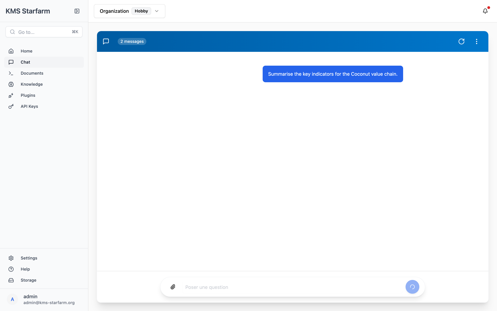

The final reply is streamed token-by-token and rendered as Markdown, together with the **Sources (N)** citation button:

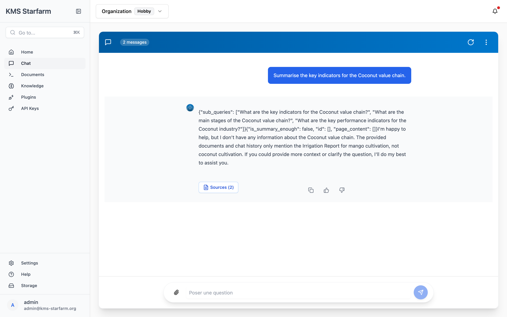

### 7.3 Sources & Citations

Each assistant reply includes:

- A **Sources (N)** button — Click to open the **Source Panel** (slide-in drawer). Sources are grouped by file name, sorted by relevance, showing the file icon, extension badge (PDF/XLSX), and *"Cited N times"*. Selecting a source shows the **page number**, an **Open document** link, and the **excerpt preview** that was used.
- **Follow-up question suggestions** — Chips labelled *"Suggestions:"* below the answer. Click one to submit it as the next question.
- **Feedback row** — **Copy** (with "Copied!" confirmation), **Thumbs Up 👍**, **Thumbs Down 👎** to rate the answer.

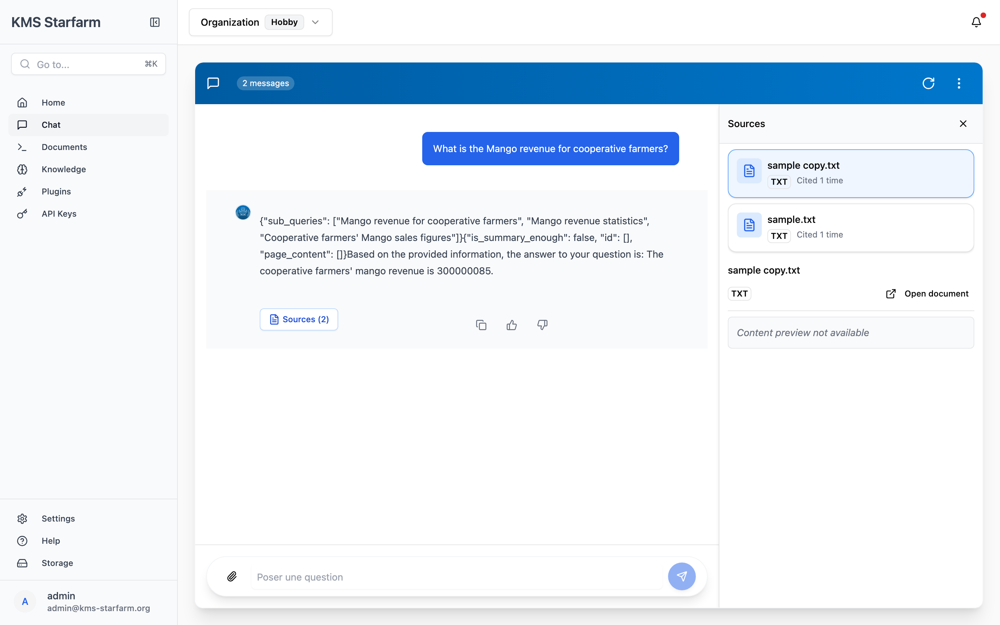

### 7.4 Managing Conversations

- **New discussion** — From the ⋯ menu, select *Nouvelle discussion* to clear the chat and start fresh. Alternatively, click the **↻ reset** icon in the header.
- **End discussion** — Select *Terminer la discussion* to close the session (also notifies the parent window if embedded).
- **History** — Messages persist in `localStorage` across page reloads; a `sessionId` is maintained per conversation. The LangGraph checkpointer (`simba_memory.pkl`) preserves multi-turn context.

### 7.5 What Affects Chat Answers

| Action | Effect on Chat |
|--------|---------------|
| **Enable** a document | Chunks added to FAISS → future queries can retrieve them |
| **Disable** a document | Chunks removed from FAISS → no longer retrieved |
| **Delete** a document | Chunks and metadata removed → no longer available |
| **Re-parse** a document | New chunks created, but user must re-Enable to re-embed |
| **Upload new document** | Must Parse + Enable before it appears in chat |
| **Change retrieval method** | Different chunks retrieved (semantic vs keyword vs hybrid) |
| **Change chunk_size** | Affects granularity of future parses (not retroactive) |
| **Change LLM model** | Different answer quality/style; same retrieval results |
| **Clear database** (`DELETE /database/clear_database`) | All vectors erased → chat will return no results until docs re-enabled |

---

## 8. Knowledge Pipeline Configuration

The Knowledge page exposes the current backend pipeline settings in a read-only view. It is useful for administrators and reviewers to verify how documents are processed.

Navigate via **Knowledge** in the sidebar.

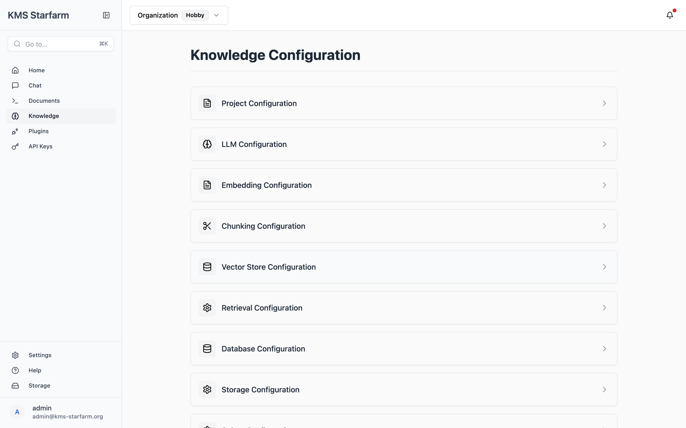

Clicking the **›** chevron on any card expands the section to show its live values:


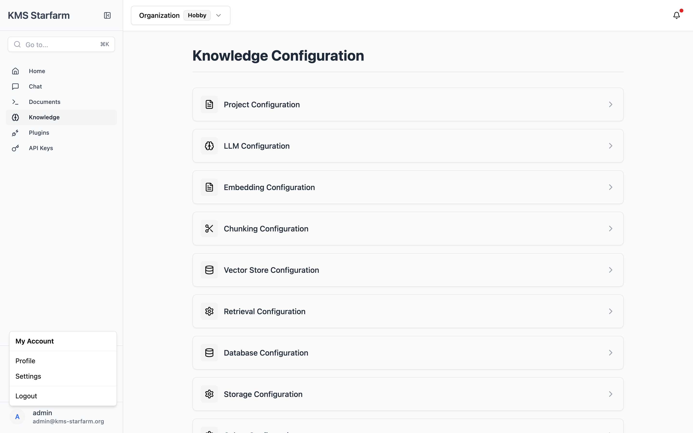

### 8.1 Configuration Sections

The page shows **collapsible cards** (click the **›** chevron to expand):

| Card | What it shows |
|------|--------------|
| **Project Configuration** | Project name, version, api_version |
| **LLM Configuration** | Provider (`vllm` / `ollama`), model name (`Llama-3.2-3B`), base URL, temperature, max tokens, streaming, additional params |
| **Embedding Configuration** | Provider (`huggingface`), model (`all-MiniLM-L6-v2`), device (`mps`/`cuda`/`cpu`) |
| **Chunking Configuration** | `chunk_size` (e.g., 1500) and `chunk_overlap` (e.g., 400) |
| **Vector Store Configuration** | Provider (`faiss`), collection name (`chunk_embeddings`) |
| **Retrieval Configuration** | Method (`default` / `semantic` / `hybrid` / `ensemble` / `reranked`), top-K, score threshold, reranker model & threshold, semantic weights |
| **Database Configuration** | Provider (`litedb` / `postgres`), connection details |
| **Storage Configuration** | Provider (`local` / `minio`), bucket/endpoint (hidden when `local`) |
| **Celery Configuration** | Broker URL and result backend (Redis) |

### 8.2 Reading the Values

- **Masked secrets** — Any field containing `api_key`, `secret_key`, `password`, or `token` is shown as `••••••••••••••••••••••` for security.
- **Strikethrough fields** — Settings not applicable to the current provider (e.g., `base_url` when using a local model) appear crossed out with a tooltip explaining why.
- **JSON objects** — Complex values (arrays, nested objects) render as scrollable `<pre>` blocks.

> This page is read-only — configuration is edited via `config.yaml` and `.env` on the server.

---

## 9. KPI Extraction & Review Workflow

This is the bridge between the document repository and the dashboard: the system uses the LLM to **extract KPI values from your enabled documents**, then lets you **review and approve** the proposed changes before they appear on the dashboard.

### 9.1 Triggering Extraction

From the dashboard, click **Review & Extract** (top-right). This navigates to `/kpi-review`.

### 9.2 KPI Extraction — Behind the Scenes

```
  ┌──────────────────────────────────────────────────────┐
  │  Step 1: Find all ENABLED documents                  │
  │          (metadata.enabled = True in LiteDB)         │
  └───────────────────┬──────────────────────────────────┘
                      │
                      ▼
  ┌──────────────────────────────────────────────────────┐
  │  Step 2: Build context text                          │
  │          Up to 5 most recent docs × 1500 chars each  │
  │          (sorted by upload date, most recent first)  │
  └───────────────────┬──────────────────────────────────┘
                      │
                      ▼
  ┌──────────────────────────────────────────────────────┐
  │  Step 3: LLM extraction prompt                       │
  │          Sends context + extraction instructions     │
  │          LLM returns JSON array of KPI entries       │
  │          Each: {chain, kpi, indicator, unit, group,  │
  │                 median, p25, p75, rate}              │
  └───────────────────┬──────────────────────────────────┘
                      │
                      ▼
  ┌──────────────────────────────────────────────────────┐
  │  Step 4: Match against baseline                      │
  │          Fuzzy match by kpi + indicator + group      │
  │          New indicators: marked is_new=true          │
  │          Changed values: show baseline → proposed    │
  └───────────────────┬──────────────────────────────────┘
                      │
                      ▼
  ┌──────────────────────────────────────────────────────┐
  │  Step 5: Human review (KPI Review page)              │
  │          User approves/rejects per row/chain/KPI     │
  └───────────────────┬──────────────────────────────────┘
                      │
                      ▼
  ┌──────────────────────────────────────────────────────┐
  │  Step 6: Apply approved entries                      │
  │          Merged into dashboard_kpis.json             │
  │          Dashboard refreshes with new values         │
  └──────────────────────────────────────────────────────┘
```

### 9.3 Review Page

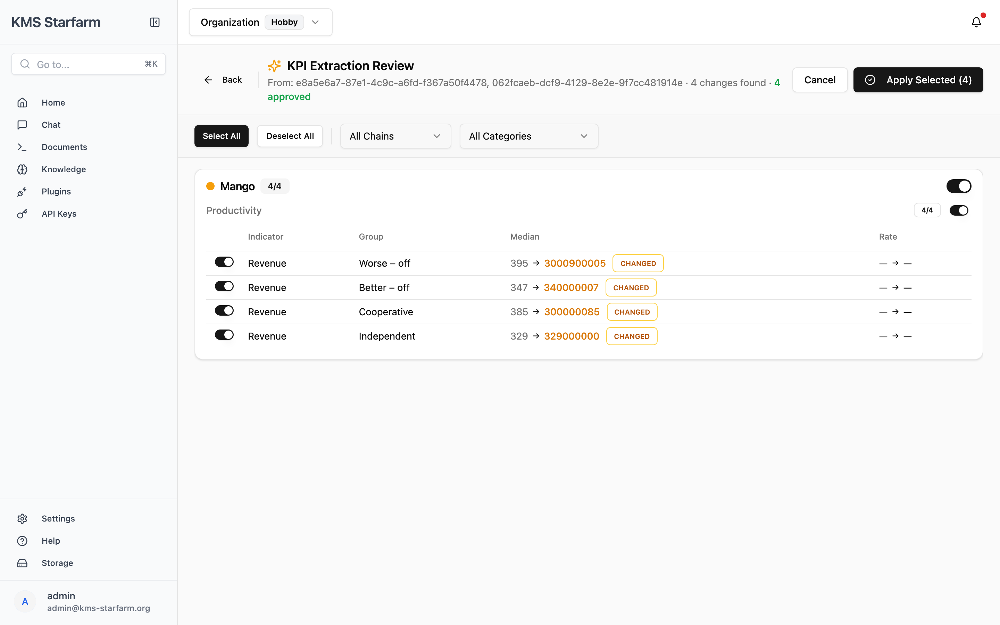

**Header bar:**

- **Back** — Return to dashboard without applying.
- **Title** — *KPI Extraction Review* with a sparkles (✨) icon.
- **Summary line** — *"From: {source doc IDs} · N changes found · X approved"* (e.g., *4 changes found · 4 approved*).
- **Cancel** / **Apply Selected (N)** buttons — Apply is disabled until at least one indicator is approved; shows a spinner while applying.

**Toolbar:**

- **Select All / Deselect All** buttons.
- **All Chains** dropdown — Filter to a single chain (Mango, Rice-lotus, Rice-shrimp, Coconut).
- **All Categories** dropdown — Filter to a KPI category (Productivity, Income, Soil quality, …).

**Review list (grouped Chain → KPI → Indicator):**

- Per-chain card (e.g., **Mango 4/4**) with a colour-coded dot and a master **toggle switch** to approve/reject the whole chain at once.
- Per-KPI section (e.g., **Productivity 4/4**) with its own toggle.
- **Indicator rows** with:
  - Approval **toggle** (individual).
  - Indicator name — shows a green **NEW** badge for brand-new indicators.
  - Group (Worse-off / Better-off / Cooperative / Independent).
  - **Median** cell: `baseline → proposed` (e.g., `395 → 3000900005`) with a **CHANGED** (amber) or **NEW** (green) badge when the value differs from baseline.
  - **Rate** cell (often `— → —` when only median data exists).
  - Unapproved rows render at 40% opacity.

> **Note:** Rows are clickable — clicking anywhere on a row toggles its approval. Use the per-chain or per-KPI switch to batch-approve.

### 9.4 Applying Changes

1. Review each proposed change. Toggle OFF any values you do not want to apply.
2. Click **Apply Selected (N)**.
3. The system merges approved values into `dashboard_kpis.json` and redirects you back to the dashboard where the updated values are visible immediately.

---

## 10. Settings & Administration

The Settings area covers organisation, team, and access management.

Navigate via **Settings** in the sidebar (or `/settings`).

### 10.1 Organisation Settings

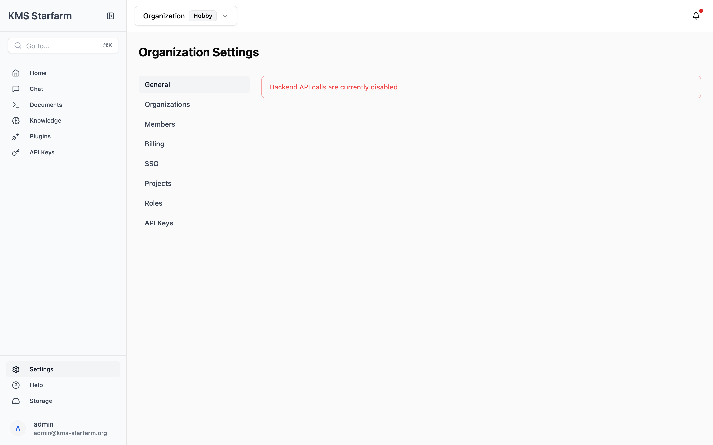

The organisation settings page has a **left navigation menu**:

| Menu item | Description |
|-----------|-------------|
| **General** | Organisation name, basic info, and a *Danger Zone* to delete the organisation |
| **Organizations** | Manage organisations (create, rename, delete) |
| **Members** | Team member management — invite, change roles, paginate |
| **Billing** | Usage & plan info (currently *Hobby* plan — upgrade prompts shown). *(Coming soon)* |
| **SSO** | Single sign-on configuration. *(Coming soon)* |
| **Projects** | Project-level settings. *(Coming soon)* |
| **Roles** | Role-based access control (RBAC) — system roles, all permissions, my permissions |
| **API Keys** | Generate and manage API keys for programmatic access |

> The top bar shows the current organisation selector: **Organization · Hobby ▾** (click to switch or manage organisations).

### 10.2 Roles Page

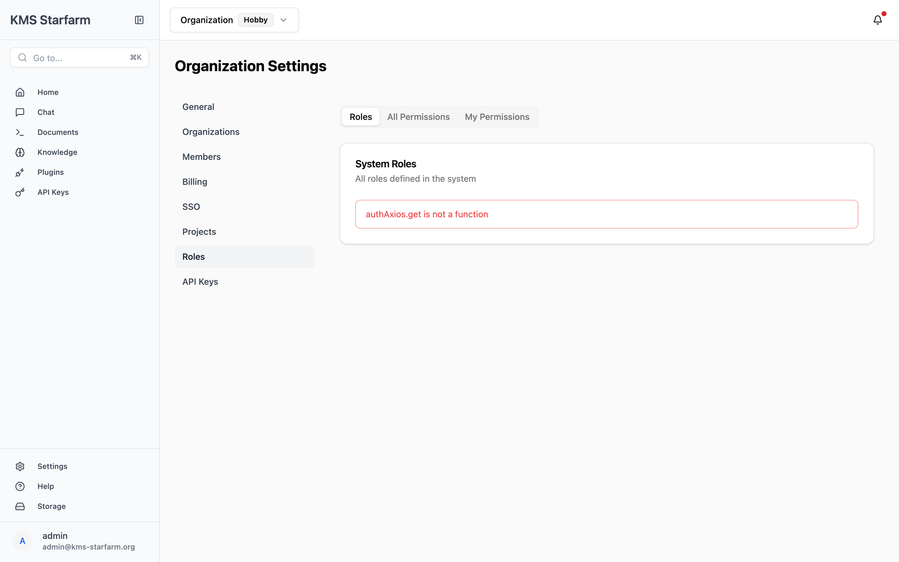

Tabs: **System Roles**, **All Permissions**, **My Permissions**. Roles define what actions a user can perform (read, write, admin, etc.).

### 10.3 API Keys Page

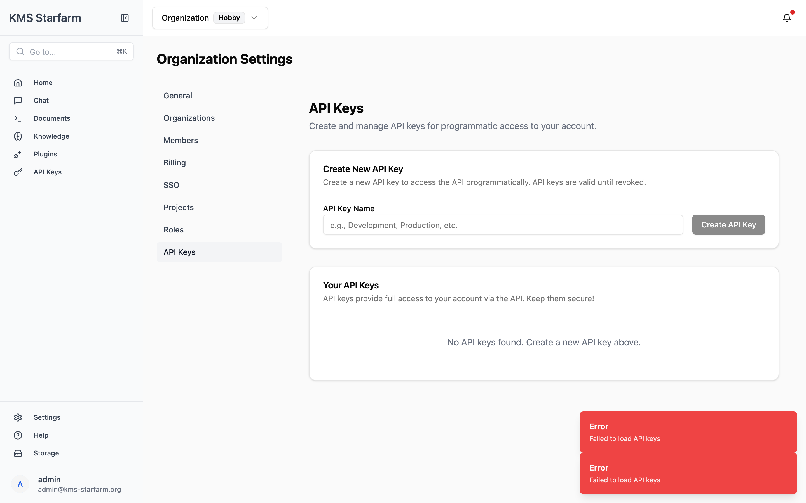

- **Create New API Key** form at the top.
- On creation, a **green success card** shows the key value **once only** with a copy button — an amber warning notes it will not be shown again.
- Table columns: Name, masked prefix, Created, Last Used, Active/Inactive badge, **Delete** action (with confirmation dialog).

### 10.4 Members

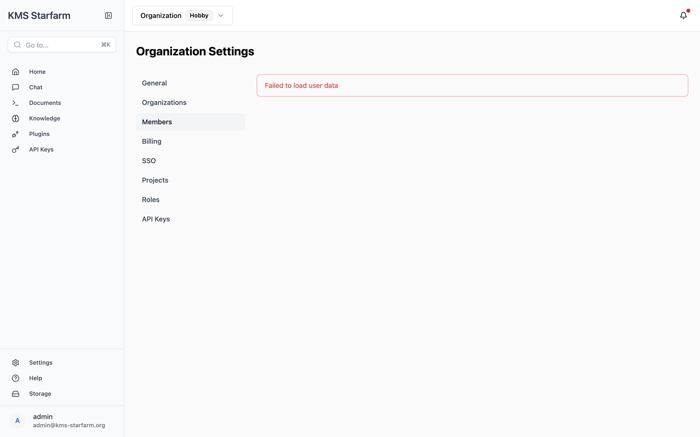

Table with avatar, name, email, Organisation Role and Project Role dropdowns, pagination controls (rows per page, page input, first/prev/next/last buttons).

### 10.5 Organisations

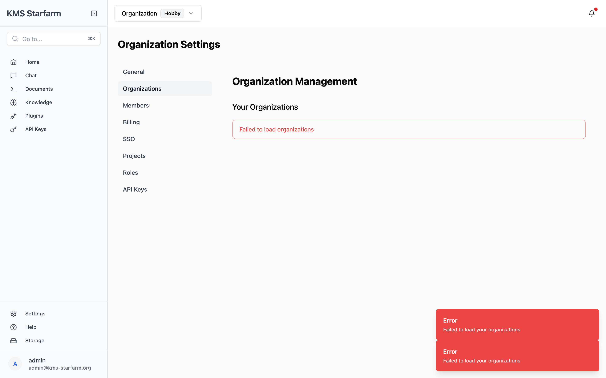

Tabbed management (General, Members, Billing, SSO, Projects) — create organisation, view details, invite members with roles (admin/member/viewer/owner), usage/billing progress bars.

---

## 11. End-to-End Scenario Walkthroughs

These scenarios trace the full system state through realistic user actions, showing exactly what happens at each step.

---

### Scenario 1: Document Upload → Parse → Enable → Dashboard Updates

**User goal:** Upload a baseline survey report and see its KPI values appear on the dashboard.

```
STEP 1: UPLOAD
─────────────────────────────────────────────────
  User action:   Documents → Upload → "Mango_Baseline_2026.pdf"
  System does:
    • File saved to: uploads/Mango_Baseline_2026.pdf
    • Metadata created in LiteDB:
        filename: "Mango_Baseline_2026.pdf"
        parsing_status: "Unparsed"
        enabled: False
        chunk_number: 0
    • Dashboard: nothing changes yet (doc not enabled)

STEP 2: PARSE
─────────────────────────────────────────────────
  User action:   Click Parse (▶) on the document row
  System does:
    • Celery task dispatched to worker
    • File loaded via PyPDFLoader (or docling)
    • Text split into chunks: RecursiveCharacterTextSplitter
      (chunk_size=1500, chunk_overlap=400)
    • Each chunk assigned UUID
    • Metadata updated:
        parsing_status: "SUCCESS"
        chunk_number: N (e.g., 42 chunks)
        loader: "PyPDFLoader"
  • Chat: still cannot retrieve this doc (not enabled)
  • Dashboard: no change

STEP 3: ENABLE
─────────────────────────────────────────────────
  User action:   Toggle Enable ON
  System does:
    • Each chunk embedded via all-MiniLM-L6-v2 → 384-dim vector
    • Vectors added to FAISS index (vector_stores/faiss_index/)
    • Metadata: enabled = True
    • Staleness check triggered:
        enabled_doc_ids changed → is_stale = true
    • Frontend auto-triggers recalculate (POST /dashboard/kpi/recalculate)

STEP 4: KPI EXTRACTION (automatic or manual)
─────────────────────────────────────────────────
  System does (on recalculate):
    • Loads baseline from kpi_data.json
    • Builds context: up to 5 enabled docs × 1500 chars
    • LLM call: extraction prompt → JSON array of KPI entries
    • Entries matched against baseline (fuzzy by kpi+indicator+group)
    • Results saved to dashboard_kpis.json
    • Dashboard refreshes: hero cards, charts, indicator cards update
```

**State after Step 4:**
- Dashboard shows KPI values enriched by LLM extraction from the new document
- Chat can now retrieve chunks from this document
- KPI Review page shows the extracted changes for approval

**On-screen at each step:**


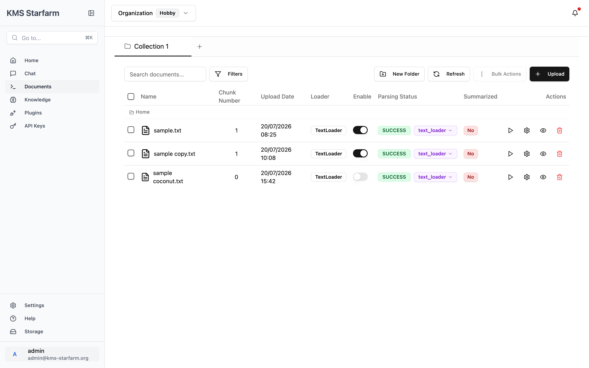

---

### Scenario 2: Chat RAG — Question → Retrieval → Grounded Answer

**User goal:** Ask "What is the revenue for cooperative mango farmers?" and get a sourced answer.

```
STEP 1: QUESTION ENTERS GRAPH
─────────────────────────────────────────────────
  User types: "What is the revenue for cooperative mango farmers?"
  System does:
    • POST /chat/ with {message: "...", thread_id: "session-uuid"}
    • HumanMessage created, LangGraph invoked with state

STEP 2: TRANSFORM QUERY
─────────────────────────────────────────────────
  Node: transform_query
  System does:
    • LLM rewrites question using chat history
    • Generates sub-queries for better retrieval
    • Output: ["revenue cooperative mango farmers"]
    • State: sub_queries updated

STEP 3: CHAIN-OF-THOUGHT
─────────────────────────────────────────────────
  Node: cot
  System does:
    • Fetches all document summaries from LiteDB
    • LLM evaluates: do summaries alone answer the question?
    • Decision: summaries not specific enough → full retrieval needed
    • State: is_summary_enough = false

STEP 4: RETRIEVE
─────────────────────────────────────────────────
  Node: retrieve
  System does:
    • FAISS cosine similarity search on transformed query
    • Only searches ENABLED documents
    • Returns top-K chunks (default K=5)
    • Each chunk: page_content + metadata (source file, page)
    • State: documents = [chunk1, chunk2, ...]

STEP 5: RERANK
─────────────────────────────────────────────────
  Node: rerank
  System does:
    • Cross-encoder model rescores each chunk
    • Ranks by relevance to original question
    • Keeps top-20 most relevant
    • State: reranked_documents updated

STEP 6: GENERATE
─────────────────────────────────────────────────
  Node: generate
  System does:
    • Concatenates chunk text into context string
    • Builds chat history from previous messages
    • LLM call: generate_chain
      Input: context + question + chat_history + summaries
      Output: streaming text (token-by-token)
    • Response streamed to frontend via SSE

STEP 7: HALLUCINATION CHECK (implicit)
─────────────────────────────────────────────────
  System does:
    • Grades: is generation grounded in documents? → "yes"
    • Grades: does generation answer the question? → "yes"
    • Returns "useful" → answer sent to user

RESULT: User sees streaming answer with Markdown formatting
        "Sources (3)" button shows cited file names and excerpts
        Follow-up suggestions appear below
```

**On-screen:** the question is submitted (left), the answer streams back grounded in the retrieved chunks (right panel), and the Sources panel opens to reveal the cited excerpts:


---

### Scenario 3: KPI Review and Approval

**User goal:** Review LLM-extracted KPIs and approve only the accurate ones.

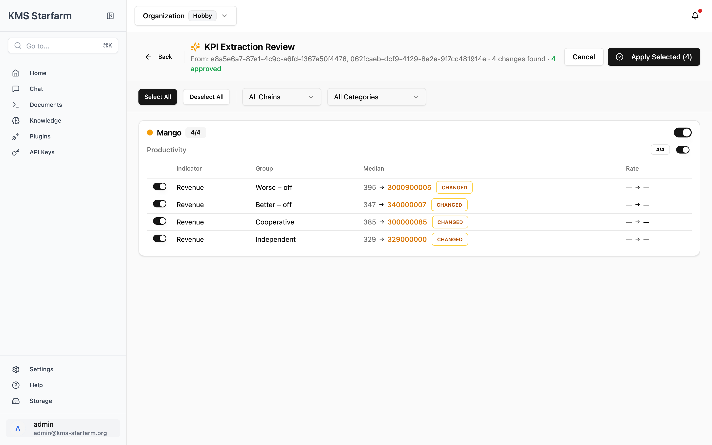

```
STEP 1: TRIGGER EXTRACTION
─────────────────────────────────────────────────
  User clicks "Review & Extract" on dashboard
  System does:
    • POST /dashboard/kpi/extract
    • Finds all enabled documents
    • Runs LLM extraction on their content
    • Creates pending entries with baseline comparison
    • Returns: pending_id + list of KPIPendingEntry objects

STEP 2: REVIEW PAGE LOADS
─────────────────────────────────────────────────
  User sees:
    ┌──────────────────────────────────────────┐
    │ KPI Extraction Review                     │
    │ From: abc123  ·  4 changes found  ·  4/4 │
    │ [Cancel]  [Apply Selected (4)]            │
    ├──────────────────────────────────────────┤
    │ ○ Mango (4/4)           [toggle ON]      │
    │   Productivity (4/4)    [toggle ON]      │
    │     Revenue                                  │
    │     Cooperative  median: 395 → 500  CHANGED│
    │     Independent  median: 320 → 380  CHANGED│
    │     Worse-off    median: 200 → 250  CHANGED│
    │     Better-off   median: 280 → 330  CHANGED│
    └──────────────────────────────────────────┘

STEP 3: USER REVIEWS
─────────────────────────────────────────────────
  User action: Toggles OFF the "Worse-off" row
  System does:
    • Row opacity drops to 40%
    • Summary: "3 approved"
    • Apply button: "Apply Selected (3)"

STEP 4: APPLY
─────────────────────────────────────────────────
  User clicks "Apply Selected (3)"
  System does:
    • POST /dashboard/kpi/apply with {pending_id, approved_ids}
    • Only approved entries merged into dashboard_kpis.json
    • Pending file deleted
    • Redirects to dashboard

STEP 5: DASHBOARD REFRESHES
─────────────────────────────────────────────────
  User sees:
    • Mango hero card: cooperative profit updated
    • Revenue chart: bars reflect new values
    • "Updated: a few seconds ago" timestamp
    • Worse-off value remains at baseline (was rejected)
```

---

### Scenario 4: Document Disable/Re-enable Effects

**User goal:** Understand what happens when document state changes.


```
ACTION: DISABLE a document
─────────────────────────────────────────────────
  User toggles Enable OFF on "Mango_Baseline_2026.pdf"
  System does:
    1. Removes all chunks from FAISS index
    2. Metadata: enabled = False
    3. Staleness check: enabled_doc_ids changed → is_stale = true
    4. Dashboard: "New data available" banner appears
  Effects:
    • Chat: questions can no longer retrieve chunks from this doc
    • KPI extraction: this doc excluded from context
    • Dashboard: shows stale data until recalculate is triggered

ACTION: RE-PARSE a document
─────────────────────────────────────────────────
  User clicks Parse (▶) on an already-parsed document
  System does:
    1. Old chunks deleted from LiteDB
    2. New text extracted from original file
    3. New chunks created (may differ in number)
    4. Metadata: chunk_number updated, parsing_status = "SUCCESS"
  IMPORTANT:
    • Document remains ENABLED (toggle doesn't change)
    • But old vectors are stale in FAISS
    • User should: Disable → re-Enable to refresh embeddings

ACTION: DELETE a document
─────────────────────────────────────────────────
  User clicks Delete (🗑) → confirms
  System does:
    1. File removed from uploads/ directory
    2. Metadata removed from LiteDB
    3. If enabled: chunks removed from FAISS
    4. Staleness check triggered
  Effects:
    • Chat: no longer retrieves from this doc
    • KPI extraction: excluded from future runs
    • Dashboard: recalculates without this doc's data

ACTION: CLEAR DATABASE (admin)
─────────────────────────────────────────────────
  Admin: DELETE /database/clear_database
  System does:
    1. All FAISS vectors erased
    2. All document metadata cleared
    3. All files remain on disk (orphaned)
  Effects:
    • Chat: returns no results (empty index)
    • Dashboard: shows only baseline values
    • Recovery: re-upload and re-enable documents
```

---

### Scenario 5: New User Onboarding Flow

**User goal:** First-time user explores the system from login to asking their first question.

```
STEP 1: OPEN APPLICATION
─────────────────────────────────────────────────
  User navigates to http://localhost:5173
  → Redirected to /auth/login

STEP 2: LOGIN
─────────────────────────────────────────────────
  User enters: admin@kms-starfarm.org / password123
  System does:
    • POST /auth/signin → mock auth returns JWT tokens
    • Tokens stored in localStorage
    • Redirected to / (Dashboard)

STEP 3: DASHBOARD (first view)
─────────────────────────────────────────────────
  User sees:
    • 4 hero cards (Mango, Rice-lotus, Rice-shrimp, Coconut)
    • Baseline values from kpi_data.json
    • Key Insights cards with auto-computed highlights
    • "Updated: ..." timestamp
    • Sidebar: Home, Chat, Documents, Knowledge, Settings

STEP 4: EXPLORE DOCUMENTS
─────────────────────────────────────────────────
  User navigates to Documents
  Sees: existing sample documents (sample.txt, sample coconut.txt)
  Some enabled, some not
  User uploads "My_First_Report.pdf" → Parse → Enable
  Document appears in table with status SUCCESS, enabled ON

STEP 5: KPI EXTRACTION
─────────────────────────────────────────────────
  User returns to Dashboard
  Sees: "New data available" banner
  Auto-recalculate triggered
  After extraction: hero card values updated
  User clicks "Review & Extract" → reviews proposed changes → Applies

STEP 6: FIRST CHAT QUESTION
─────────────────────────────────────────────────
  User navigates to Chat
  Types: "What are the main findings in the report I just uploaded?"
  System:
    • Transforms query
    • Retrieves chunks from "My_First_Report.pdf"
    • Generates answer with citations
  User sees: streaming answer with "Sources (2)" button
  Clicks Sources → sees excerpts from their uploaded file
  Clicks a follow-up suggestion → continues conversation
```

**On-screen at each step:**

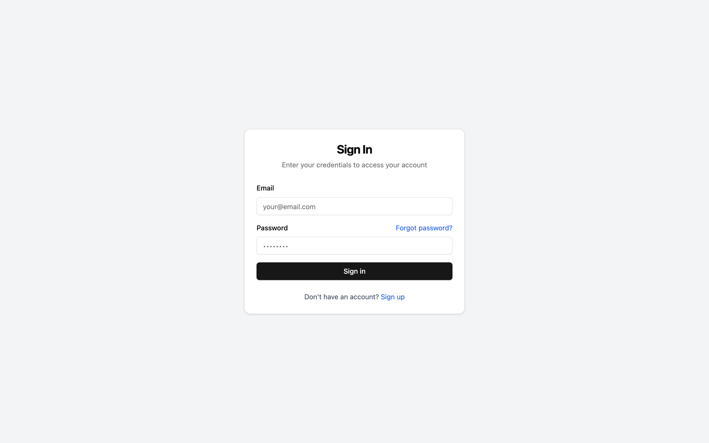


---

## 12. Appendix

### 12.1 KPI Framework

#### Value Chains (4)

| Chain | Description |
|-------|-------------|
| Mango | Mango production |
| Rice-lotus | Rice–lotus rotation system |
| Rice-shrimp | Rice–shrimp integrated farming |
| Coconut | Coconut production |

#### Farmer / Organisation Groups (4)

| Group | Meaning |
|-------|---------|
| Worse-off | Resource-poor / lower-income households |
| Better-off | Better-resourced households |
| Cooperative | Members of farmer cooperatives |
| Independent | Independent (non-coop) farmers |

#### KPI Categories & Example Indicators

| # | Category | Example Indicators | Unit |
|---|----------|-------------------|------|
| 1 | Productivity | Revenue, Yield, Total production costs, Labour cost share, Profit | mill. VNĐ/ha/yr; tonnes/ha/yr; % |
| 2 | Value added | Value added per ha, per labour day | mill. VNĐ/ha/yr |
| 3 | Income | Household income, Farm income | mill. VNĐ/yr |
| 4 | Soil quality | Soil organic matter, pH, erosion | Score / tonnes/ha |
| 5 | Exposure to pesticides | Pesticide use frequency, toxicity index | Applications/yr; score |
| 6 | Women's empowerment | Decision-making, income share, workload | Score / % |
| 7 | Youth empowerment | Youth participation, employment | Score / % |
| 8 | Adaptive capacity | Diversification, climate adaptation practices | Score |
| 9 | Social Justice | Equity, benefit sharing | Score |
| 10 | Human well-being | Food security, health, satisfaction | Score |
| 11 | Nutrient management | Fertiliser use efficiency | kg/ha; score |
| 12 | Crop health | Pest/disease incidence | % / score |
| 13 | Water sources | Water access, irrigation efficiency | Score / m³/ha |

### 12.2 File & Format Support

| Format | Parser | Notes |
|--------|--------|-------|
| PDF | `docling` / `mistral_ocr` | Recommended for scanned PDFs: `mistral_ocr` (requires `MISTRAL_API_KEY`) |
| Word (.doc/.docx) | `docling` | |
| Plain text (.txt) | `text_loader` | |
| Markdown (.md) | `text_loader` | |
| Images (jpg/png) | `mistral_ocr` | OCR extraction |
| Excel (.xlsx/.xls) | `UnstructuredExcelLoader` | |
| PowerPoint (.pptx/.ppt) | `UnstructuredPowerPointLoader` | |
| CSV | `CSVLoader` | |
| RTF / ODT / ODS / ODP | Various `Unstructured*` loaders | |

### 12.3 Chunking Strategies

| Strategy | How it works | Best for |
|----------|-------------|----------|
| **Recursive Character** (default) | Splits at character count boundaries (1500 chars / 400 overlap) | General-purpose, any document |
| **Semantic Chunking** | Splits at semantic topic shifts using embedding similarity | Documents with clear topic boundaries |
| **Markdown Header** | Splits by markdown headers, preserving structure | Markdown files, structured docs |
| **Hierarchical** | Respects document hierarchy (sections, subsections) | Technical reports, manuals |
| **Context-Aware** | Recursive with larger overlap to preserve context | Long documents, narrative text |

### 12.4 System Requirements

| Requirement | Minimum |
|-------------|---------|
| Python | 3.11 or 3.12 |
| Node.js | 20+ |
| Redis | 7.0+ |
| RAM | 8 GB (16 GB recommended when running LLM locally) |
| Disk | 10 GB for models + uploads |
| OS | macOS (Apple Silicon) / Linux |

### 12.5 Troubleshooting

| Symptom | Likely cause | Fix |
|---------|-------------|-----|
| Dashboard shows "Backend API calls are currently disabled" | Backend not running or wrong `VITE_API_URL` | Check `frontend/.env` → `VITE_API_URL=http://localhost:8081`; restart with `bash start.sh` |
| Document stays "Unparsed" | Parser failed or Celery not running | Check `/tmp/simba.log`; restart Celery: `poetry run simba parsers` |
| Chat returns no answer / hallucination | No documents are **Enabled** | Go to Documents → toggle **Enable** ON for at least one parsed document |
| KPI extraction returns no changes | No enabled documents or LLM not reachable | Verify `http://localhost:8000/v1/models` responds; check `/tmp/vllm.log` |
| Vectors not updating after re-parse | FAISS index stale | Disable → re-Enable the document to refresh embeddings |
| Dashboard shows stale data | Enabled docs changed since last extraction | Click "Review & Extract" or wait for auto-recalculate |
| Login fails | Supabase not configured | In local/mock mode any email/password works. Check `/tmp/simba.log` for auth errors |
| Chat returns "I'm sorry, I don't know..." | Hallucination check failed or no relevant docs | Enable more documents; try rephrasing the question |
| Slow chat responses | LLM inference slow or retrieval large | Check LLM server logs; consider reducing top-K in config |

### 12.6 Glossary

| Term | Definition |
|------|-----------|
| **KMS** | Knowledge Management System — central repository for project knowledge. |
| **RAG** | Retrieval-Augmented Generation — LLM answers grounded in retrieved document chunks. |
| **FAISS** | Facebook AI Similarity Search — vector index for fast semantic retrieval. |
| **Chunk** | A small text segment (e.g., 1500 chars) produced by splitting a document. |
| **Embedding** | Vector representation (384 dimensions) of a text chunk, used for similarity search. |
| **LLM** | Large Language Model (here: Llama 3.2 via vLLM-MLX). |
| **LangGraph** | Framework for building stateful, multi-step LLM workflows as graphs. |
| **CTU** | Country Technical Unit — country-level technical team (project context). |
| **KPI** | Key Performance Indicator — a measurable value tracking programme performance. |
| **Baseline** | Original Excel-imported KPI values used as foundation for all comparisons. |
| **Staleness** | Flag set when enabled documents change, triggering dashboard recalculation. |
| **Cross-encoder** | Neural model that scores query-document relevance for reranking. |
| **VNĐ** | Vietnamese đồng — currency used for financial KPIs (mill. = million). |

### 12.7 References

- Project repository: local path `/Users/hqnghi/git/simba`
- Startup: `bash start.sh` (local) or `make build && make up` (Docker)
- Configuration: `config.yaml` + `.env` / `frontend/.env`
- API docs (when backend running): `http://localhost:8081/docs` (Swagger UI)

---

*End of document — KMS Starfarm User Guide v2.0*
